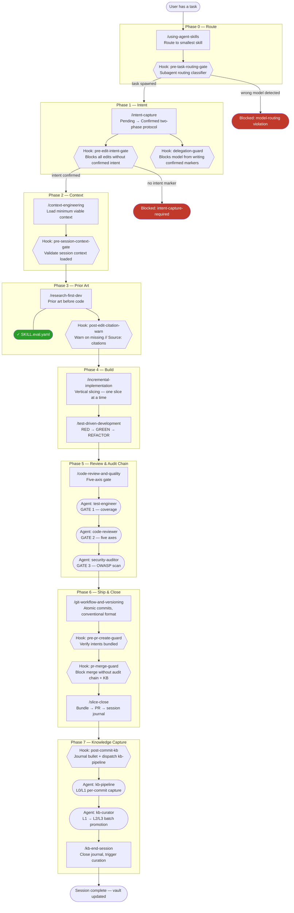
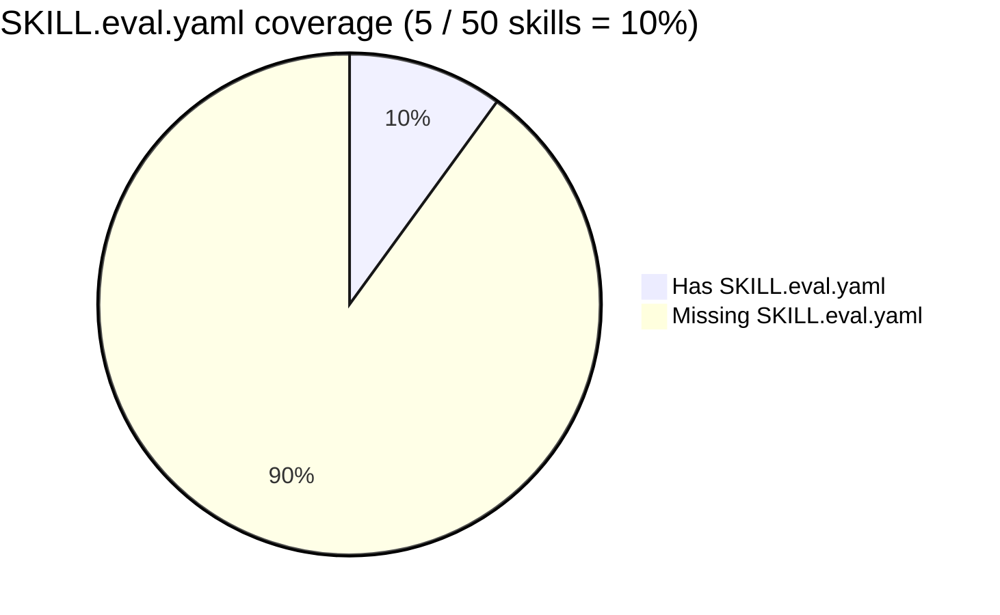
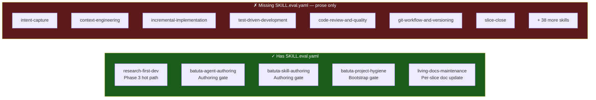
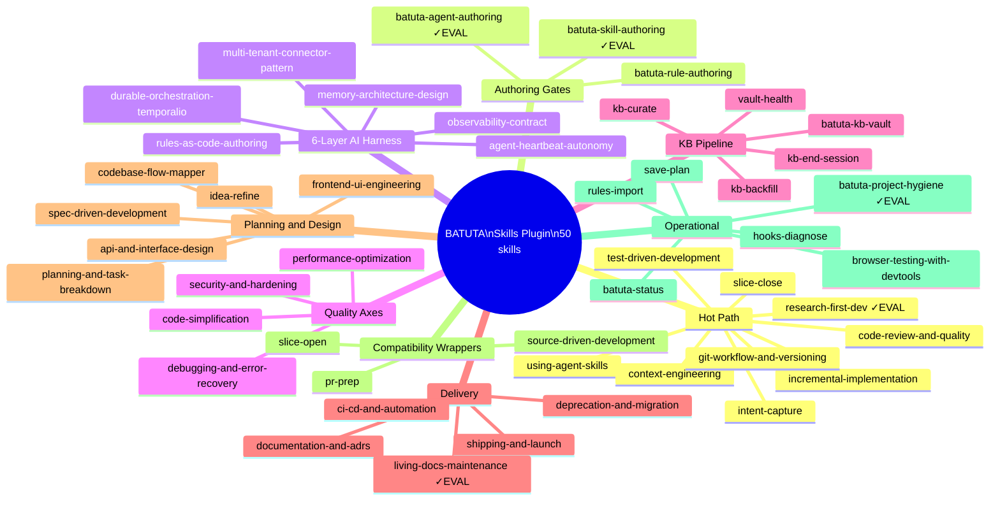
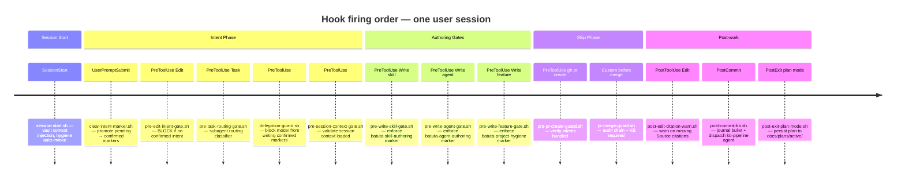
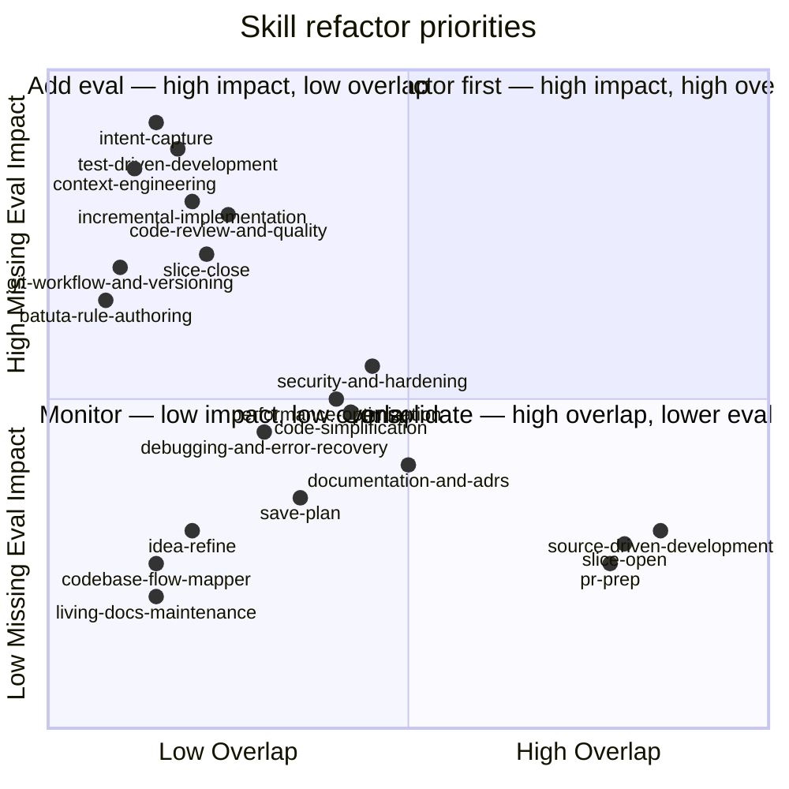
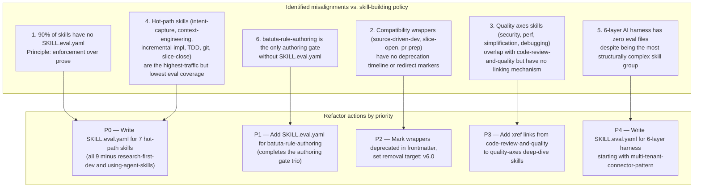

# User Journey — BATUTA Agent Skills Plugin

> Diagnostic snapshot for the v5.x refactor. Shows the intended flow, enforcement gaps, and skill taxonomy misalignments.

---

## 1. Primary Hot Path (The Nine-Skill Loop)

Every user task enters here. Hooks enforce checkpoints at runtime — the prose-only skills have no machine enforcement.

---

## 2. SKILL.eval.yaml Coverage Gap

Only 5 of 50 skills have machine-verifiable acceptance criteria. The other 45 are prose-only — hook enforcement cannot reach inside them.

### Skills WITH eval (green — hook-enforceable)

---

## 3. Skill Taxonomy — All 50 Skills

---

## 4. Hook Enforcement Timeline

Shows where the 14 hooks fire relative to the user journey. Gaps between hooks = unguarded zones.

---

## 5. Refactor Priority Map

---

## 6. Alignment Gaps Summary

---

## Notes

- **Source of truth:** `user-settings/CLAUDE.md` — all hooks, agents, skills derive authority from it.
- **Skill anatomy spec:** `docs/skill-anatomy.md` — defines required sections and writing principles.
- **Current skill count:** 50 (target after wrapper removal: ~46).
- **Hooks enforced:** 14 shell scripts + hooks.json; gaps identified above in Phases 3–5.
- **Audit chain is sequential (ADR-0004):** test-engineer → code-reviewer → security-auditor — never parallel.
