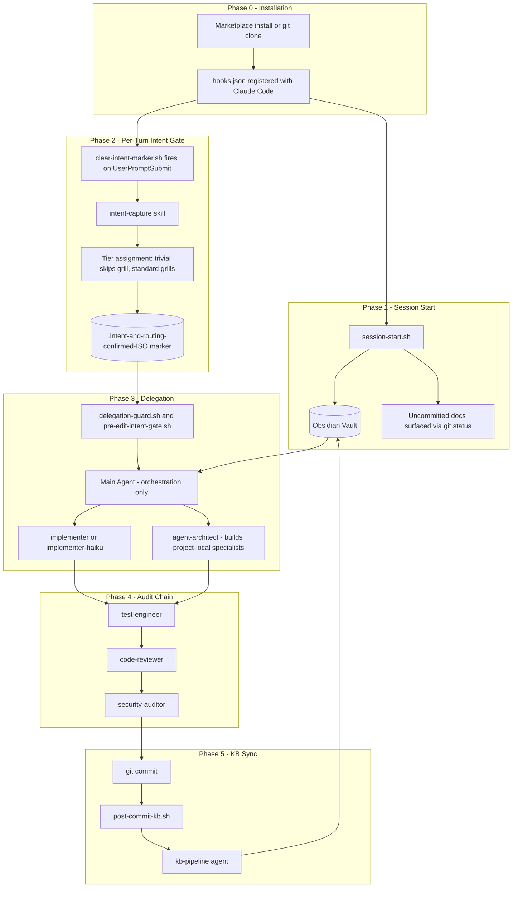
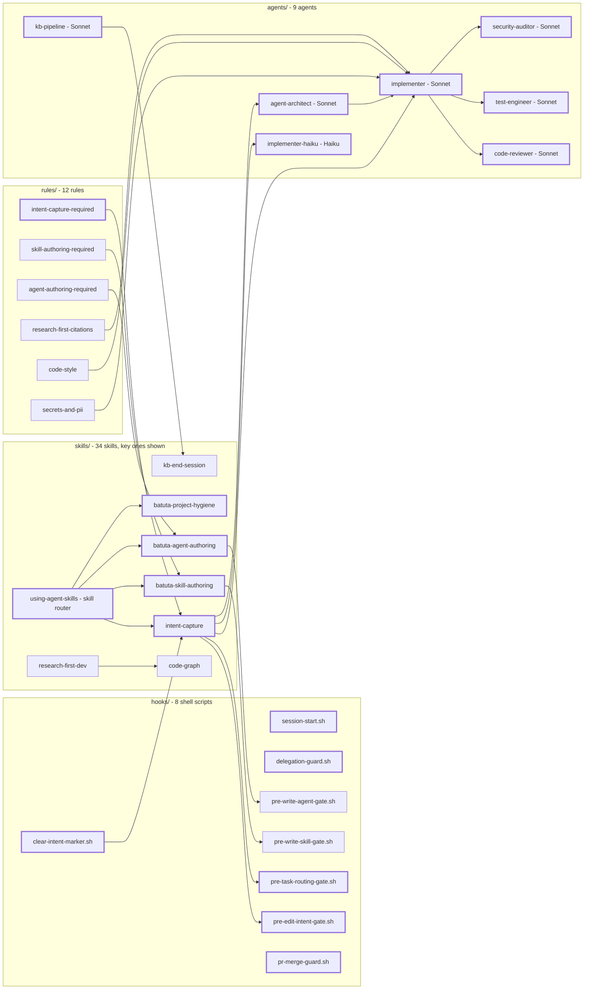

# batuta-agent-skills — Pipeline Architecture

Generated: 2026-05-07 | Commit: 753ca22 | Branch: feat/codebase-flow-mapper-IC-014

---

## Diagram 1 — System View

Six pipeline phases that make up the user journey from installation to KB sync. Cylinder nodes are persistent data stores.

---

## Diagram 2 — Module Internals

Four source modules. Bold-bordered nodes are entry points called from other modules. Edges show dependency and invocation paths.

---

## Diagram 3 — Data Lineage

Cylinder nodes are data stores. Labeled edges show which module reads, writes, or deletes each store. Flagged nodes indicate ownership conflicts or duplicate sources of truth.

```mermaid
flowchart TB
    subgraph EPHEMERAL["Ephemeral Markers - .claude/"]
        D1[(".intent-and-routing-confirmed-ISO")]
        D2[(".authoring-marker-skill-ISO")]
        D3[(".authoring-marker-agent-ISO")]
    end

    subgraph DISCOVERY["Discovery Docs - docs/"]
        D4[("docs/intents/IC-NNN.md")]
        D5[("docs/sessions/YYYY-MM-DD.md")]
        D6[("docs/plans/active/slug.md")]
    end

    subgraph KB_STORES["KB Stores"]
        D7[("Obsidian Vault<br/>decisions, gotchas, playbooks")]
        D8[("Code Graph Cache<br/>codebase-memory-mcp")]
    end

    IC_SK["intent-capture skill"] -->|writes| D1
    IC_SK -->|writes standard tier only| D4
    CI_H["clear-intent-marker.sh"] -->|deletes| D1
    IG_H["pre-edit-intent-gate.sh"] -->|reads| D1
    TG_H["pre-task-routing-gate.sh"] -->|reads| D1

    SKA_SK["batuta-skill-authoring"] -->|writes| D2
    AGA_SK["batuta-agent-authoring"] -->|writes| D3
    SG_H["pre-write-skill-gate.sh"] -->|reads| D2
    AGG_H["pre-write-agent-gate.sh"] -->|reads| D3

    KBE_SK["kb-end-session skill"] -->|writes| D5
    SAV_SK["save-plan skill"] -->|writes| D6
    SS_H["session-start.sh"] -->|reads| D4
    SS_H -->|reads| D5
    SS_H -->|reads| D6
    SS_H -->|reads| D7

    KB_P["kb-pipeline agent"] -->|writes| D7
    SETUP_T["setup-code-graph.sh"] -->|writes| D8
    IMPL_A["implementer agent"] -->|reads| D8
    CG_SK["code-graph skill"] -->|reads| D8
```

---

## Analysis

| Severity | Finding | Type | Detection |
|---|---|---|---|
| HIGH | `.intent-and-routing-confirmed-ISO` has dual ownership | Ownership conflict | Written by `intent-capture`, deleted by `clear-intent-marker.sh` — two modules mutate the same file family |
| MEDIUM | Session context read from two sources | Duplicate source of truth | `session-start.sh` reads both `docs/sessions/*.md` AND Obsidian Vault for session history — they can diverge |
| MEDIUM | Intent data duplicated across two stores | Duplicate source of truth | `docs/intents/IC-NNN.md` (standard tier) records the same intent that `docs/sessions/*.md` summarizes at slice close |
| LOW | `hooks/` has 8 scripts — above the 7-function split threshold | Oversized module | 8 hook scripts serve 5 distinct event types; grouping by event type would yield 3 smaller modules |
| LOW | `batuta-status`, `kb-backfill`, `source-driven-development`, `browser-testing-with-devtools`, `context-engineering`, `idea-refine` have no auto-triggers in CLAUDE.md | Orphaned skills | Public skills with no MUST-trigger declaration — accessible only by explicit slash command |
| INFO | `using-agent-skills` routes to itself via `intent-capture` which re-invokes routing | Cycle risk | `using-agent-skills` → `intent-capture` → routing decision → possibly `using-agent-skills` again on ambiguous input |

---

## Recommendations

1. **Ownership conflict on intent markers** — designate `intent-capture` as the sole owner of `.intent-and-routing-confirmed-*` files. Rename the clear script's responsibility to `clear-stale-markers` and make it only delete markers older than the current turn timestamp, not all markers blindly. This makes the lifecycle explicit: intent-capture creates, clear-stale-markers prunes, gates read-only.

2. **Duplicate session sources of truth** — choose one canonical source for session history. Option A: make `session-start.sh` read only from the Obsidian Vault (KB is the truth, docs/sessions/ is the local draft). Option B: make `kb-pipeline` write only when `kb_pipeline_enabled: true` and have `session-start.sh` fall back to `docs/sessions/` when vault is unreachable. Currently both are read unconditionally and can produce conflicting context.

3. **Intent data duplication** — `docs/intents/IC-NNN.md` and the slice-close session journal entry both record the same intent. Keep the intent doc as the canonical audit trail (it has the grill Q&A); make the session journal entry a one-line reference (`See IC-NNN`) rather than a summary.

4. **Hooks module split** — reorganize `hooks/` into three sub-files by event type: `lifecycle/` (session-start, clear-intent-marker), `write-guards/` (delegation-guard, intent-gate, skill-gate, agent-gate), `commit-guards/` (pr-merge-guard, post-commit-kb). `hooks.json` stays flat; the directory split is for maintainability only.

5. **Orphaned skills** — add MUST-trigger declarations to `batuta-status` (end-of-session), `browser-testing-with-devtools` (any frontend change), and `context-engineering` (session-start when context > 60%). Remove or merge `source-driven-development` into `research-first-dev` — they share the same trigger and 80% of their procedure.
